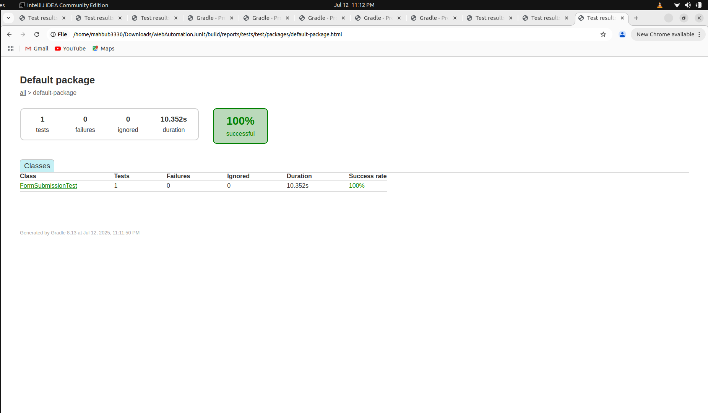
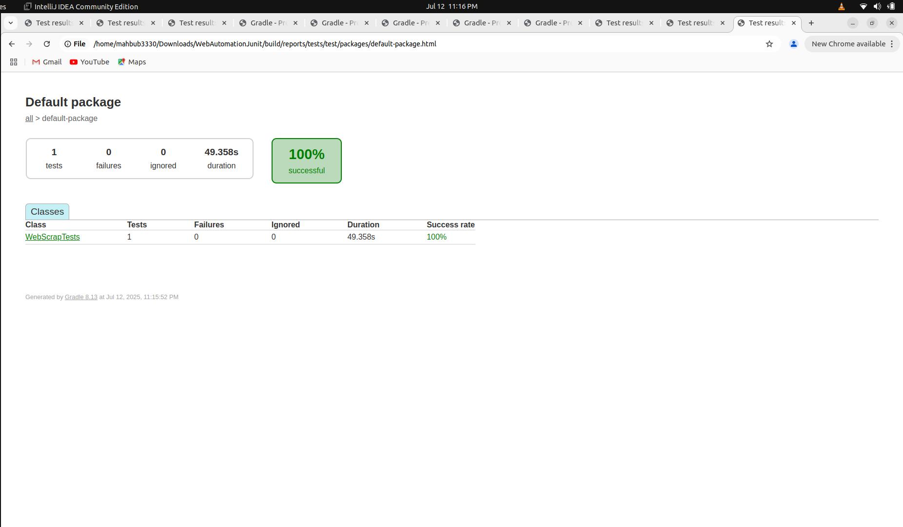

# web-automation

## How to run
- Clone this project using `https://github.com/prianka97/web-automation.git`
- Import this project in the IntelliJ
- Sync all gradle
- Run command `./gradlew clean test --tests "WebScrapTests"` for web-scrap
- Run command `./gradlew clean test --tests "FormSubmissionTest"` for form-submission
## Prerequisite
- Install JDK 17
- Install Gradle

## Technology 
- JAVA

## Form Submission

![video] (https://drive.google.com/file/d/1s55mYFqhj1e6iyR7WQnzIA4pMBOVCFUV/view?usp=sharing)

## Web Scrap 

![video] (https://drive.google.com/file/d/1HstI4mTHOE9cL_YA6vNQ4l1O6nAW-R2B/view?usp=sharing)

